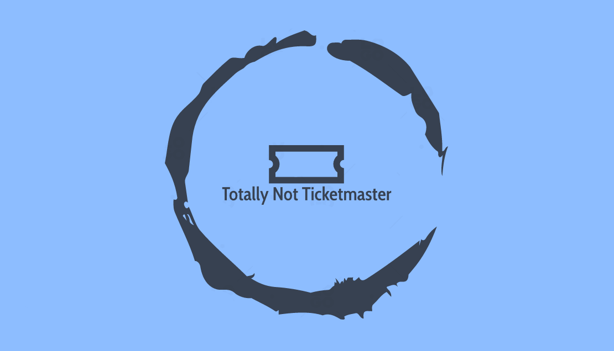


 ## CPSC Relational Database: Team 46

Project Description: Our project Totally Not Ticketmaster is a tool that can be used
to store and view data related to tickets, users, and purchases, as well as perform
specific queries to gather information.

In order to develop our project, we used the following tools:

● Node.js - Hosts the server

● React.js - Front-end user interface

● Express - Manages the node server routes, request/response/error handling

● Postgres - Our database management system, this is where our data is stored
Queries are executed using postgres’ connection pool query function, which is done after the proper API endpoint is called by the user interface.

For detail development progress report, please refer to milstone pdf in each corresponding folder.

## ER diagram iteration:

ER diagram version 1:

ER diagram version 2:

